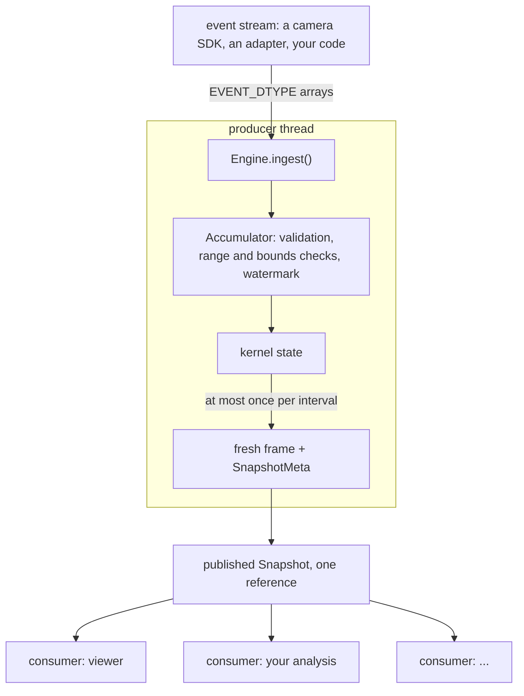

# Architecture

The producer does all of the work: validation, accumulation and publication run inside
`ingest()`, on the thread that calls it. Consumers only read the latest published snapshot,
either when they choose (`snapshot()`) or when a publication wakes them
(`wait_for_newer()`). Nothing flows from a consumer back to the producer. The
[overview](../index.md) draws this arrangement next to two common coupled pipelines.

## Components

| component | what it owns |
|---|---|
| **Accumulator** (`frames2py.Accumulator`) | Accumulation through one kernel: structural validation, the timestamp-range check, the bounds check, the watermark, the out-of-bounds count, the kernel's state. Synchronous; no threads, no publication. |
| **Engine** (`frames2py.Engine`) | An Accumulator (internal, not exposed), the publication cadence, the published snapshot, the lifecycle (`start`, `stop`, `reset`), producer ownership and statistics. |
| **Kernel** (`frames2py.kernels.Kernel`) | The representation: how in-bounds events change the state, how the state is read out, what happens at a window boundary. A public protocol; the seven built-in kernels implement it and so can yours. |
| **Snapshot publisher** (`frames2py.publish.ImmutablePublisher`) | The hand-off between the producer and consumers: each publication is a new buffer, stored with its metadata as one `Snapshot`. |

## The ingest path

Each `Engine.ingest(events)` call does, in order, on the caller's thread:

1. **Producer check.** A call from any thread other than the producer's raises
   `RuntimeError` and changes nothing.
2. **Lifecycle check.** While stopped, `ingest()` is a no-op.
3. **Structural validation** of the array: type, fields, field dtypes, dimensionality,
   contiguity. `TypeError` on failure. Values are not inspected.
4. **Timestamp-range check** over the whole call: any `t >= 2**63` rejects the call with
   `ValueError`, before any state or statistic changes.
5. **Bounds check**: one `max()` over `x` and one over `y`. Only if an event lies outside
   the sensor is a mask built; those events are counted and dropped from the kernel's view.
6. **Kernel accumulation** of the in-bounds events, with the kernel's own strategy.
7. **Publication**, if this is the first call or `snapshot_interval_ms` has elapsed since
   the last publication.

The results never depend on how Frames2Py internally splits a call. (`exp_decay` does depend
on how *you* split events into calls; see [Kernels](kernels.md#expdecay).)

## Rules the design keeps

**`ingest()` never waits on consumers.** Frames2Py puts no synchronisation on the producer
path that consumer activity can hold or control: no lock a consumer takes, no condition
variable, no retry or spin loop caused by readers, no queue that waits for consumers to
drain, no waiting for a consumer to release a buffer. `snapshot()` and `stats` take no lock.
Each publication also releases the threads blocked in `wait_for_newer()`: one lock release
per waiter, and one operation on the waiter registry even when nobody waits. That is
bounded work that never waits for a consumer.
This is not a promise that the producer is never delayed: it runs in CPython, where the GIL
(on standard builds), CPython's own per-object locks (the snapshot list's, the waiter
registry's), garbage collection, the allocator and
thread scheduling can all delay a thread. "Never waits" also does not mean "fast":
`ingest()` does real CPU work on the caller's thread. The lifecycle calls (`start`, `stop`,
`reset`) share a lock with `ingest()` so that each runs whole; they are control calls, not
consumers. See [Lifecycle and threads](lifecycle.md).

**The Engine never calls consumer code.** There are no callbacks, hooks or observers. A
consumer pulls `snapshot()` when it wants to, or blocks in `wait_for_newer()`; the only
notification is that a publication releases the locks of registered waiters, which then run
on their own threads.

**The recorder stays off the ingest path.** The [recorder](../data/recorder.md) is a sink
your loop writes to next to `ingest()`. The Engine never calls it and never waits for it;
`ingest()` does the same work with or without a recorder. The recorder starts no thread.

**Optional extras stay optional.** `import frames2py` needs NumPy only. Adapters, the
recorder and the viewer import their libraries (dv-processing, h5py, hdf5plugin, pyglet)
only when a function that needs them is called, and raise `ImportError` naming the extra if
the library is missing.

**No unbounded history.** The Engine keeps the current kernel state and the latest
published snapshot, nothing older. A consumer that wants history keeps it.

## How the hand-off works

Each publication allocates a new array, the kernel's state is read into it, the array is
marked read-only, and the frame is stored together with its `SnapshotMeta` as one `Snapshot`
object in a one-element list. `snapshot()` loads that list item and returns it: it never
copies, never retries, and never sees a buffer that is still being written. Frame and
metadata always come from the same publication, because they are one object.

What this relies on, stated precisely:

- **Documented by CPython:** reading and writing a single list item are atomic operations.
- **CPython implementation behaviour, not a Python language guarantee:** that a reader which
  loads the new item also sees the frame data written before the store. On free-threaded
  CPython 3.14, the store is a release store made under the list's per-object lock, and the
  load is a sequentially consistent atomic load that takes a guarded reference, falling back
  to the list's lock. On standard builds the GIL orders them.

So the hand-off does involve synchronisation: CPython locks the list during the store.
What Frames2Py avoids is synchronisation that consumers can hold. This is why the Engine
refuses free-threaded builds whose CPython source behaviour hasn't been checked (see
[Lifecycle and threads](lifecycle.md#free-threaded-cpython)).

## What is deliberately absent

- **No timer thread.** Publication happens only inside `ingest()` and `stop()`. If the
  producer stops calling `ingest()`, the events of the current window stay unpublished until
  the next `ingest()` or `stop()`.
- **No buffering between producer and kernel.** Each call is accumulated before `ingest()`
  returns. There is nothing to overflow and nothing is dropped, except out-of-bounds events,
  which are counted.
- **No multi-producer mode.** One Engine has one producer thread.
- **No format decoding in the core.** Adapters turn files into `EVENT_DTYPE` arrays at the
  edge; the core only sees arrays.
